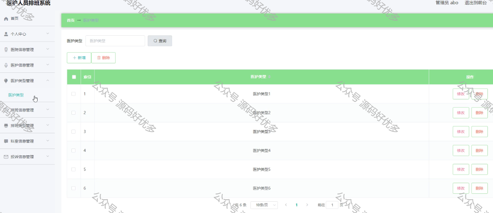
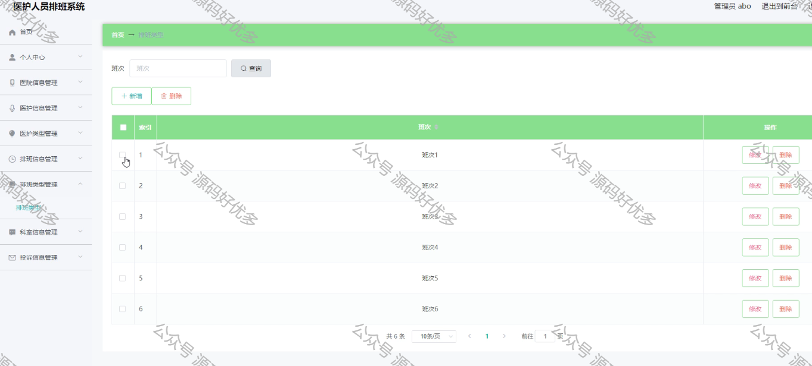
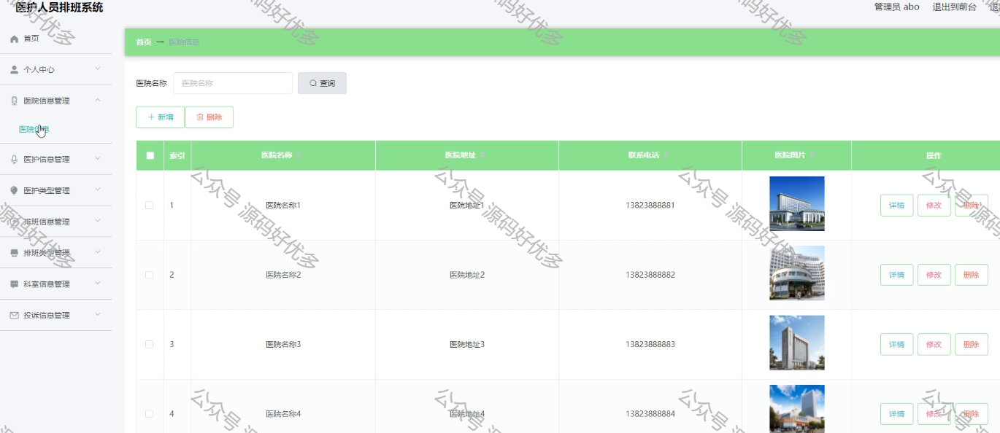

 
## 查看首页获取源码

> **作者介绍**： **✌**全网粉丝10W+本平台特邀作者、博客专家、CSDN新星计划导师、java领域优质创作者,博客之星、掘金/华为云/阿里云/InfoQ等平台优质作者、专注于毕业项目实战 **✌**

  

### 一、作品包含

源码+数据库+设计文档万字LW+PPT开题报告+全套环境和工具资源+部署教程

### 二、项目技术

前端技术：Html、Css、Js、Vue、Element-ui

数据库：MySQL

后端技术：Java、Spring Boot、MyBatis

  

### 三、运行环境

开发工具：IDEA/eclipse

数据库：MySQL8.0

数据库管理工具：Navicat10以上版本

环境配置软件： JDK1.8+Maven3.6.3

前端Nodejs：16

  

### 四、项目介绍

项目编号：springboot002

随着信息技术在管理上越来越深入而广泛的应用，管理信息系统的实施在技术上已逐步成熟。本文介绍了医护人员排班系统的开发全过程。通过分析医护人员排班系统管理的不足，创建了一个计算机管理医护人员排班系统的方案。文章介绍了医护人员排班系统的系统分析部分，包括可行性分析等，系统设计部分主要介绍了系统功能设计和数据库设计。
本医护人员排班系统管理员，医护。管理员功能有个人中心，医院信息管理，医护信息管理，医护类型管理，排班信息管理，排班类型管理，科室信息管理，投诉信息管理。医护人员可以修改自己的个人信息，查看自己的排班信息，查看我的收藏信息。因而具有一定的实用性。
本站是一个B/S模式系统，采用Spring Boot框架，MYSQL数据库设计开发，充分保证系统的稳定性。系统具有界面清晰、操作简单，功能齐全的特点，使得医护人员排班系统管理工作系统化、规范化。本系统的使用使管理人员从繁重的工作中解脱出来，实现无纸化办公，能够有效的提高医护人员排班系统管理效率。

### 五、运行截图

  
